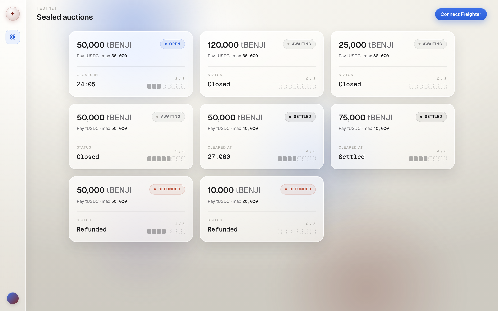
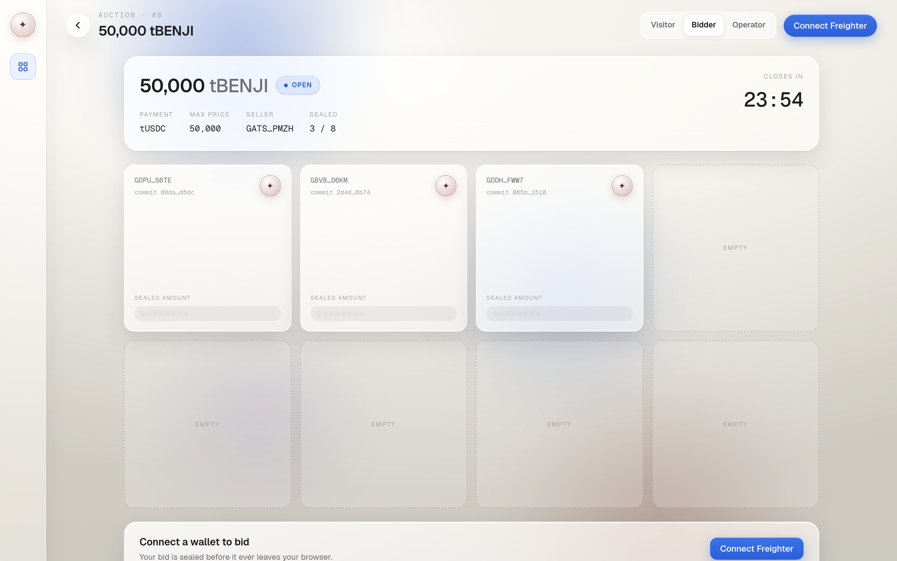
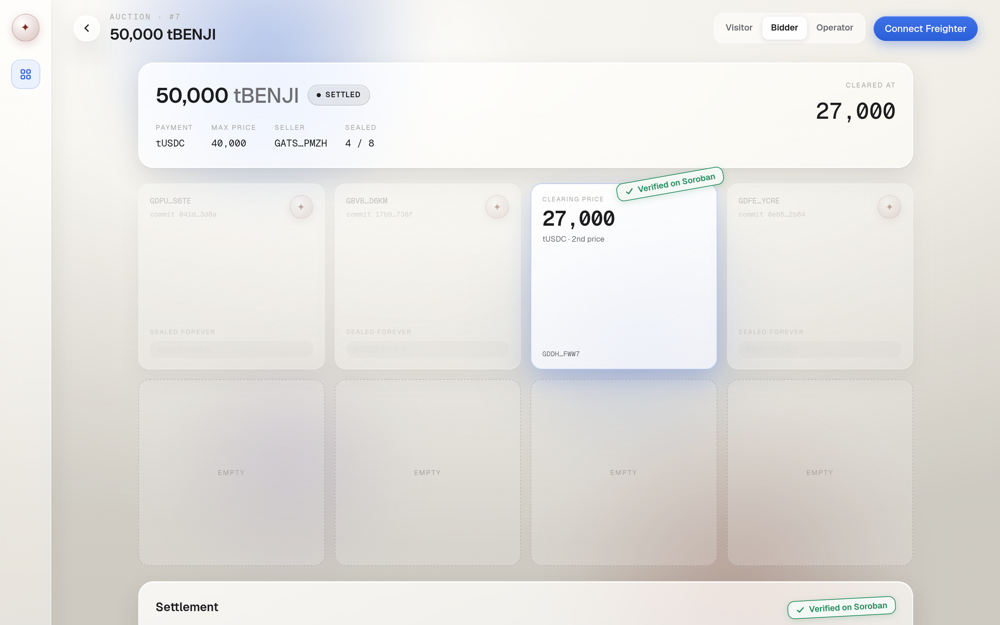
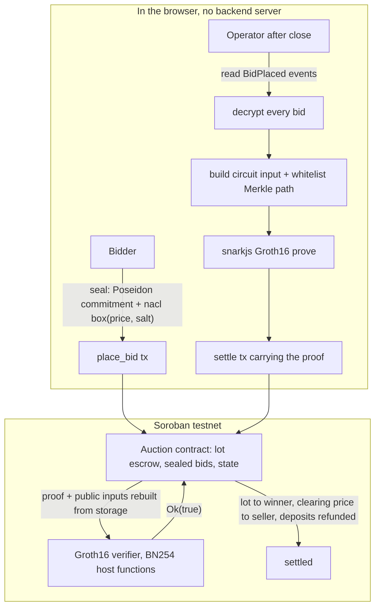

# SealedStellar

Sealed-bid Vickrey auctions for tokenized real-world assets on Stellar, where a
zero-knowledge proof, not a trusted server, decides who won and what they pay.
No bid amount is ever revealed on chain, the winner's included.

Built for the Stellar Hacks: Real-World ZK hackathon.




| Bidding (sealed) | Settled (Vickrey second price, verified on chain) |
| --- | --- |
|  |  |

## The problem

On a public blockchain every bid is visible the moment it lands. For a large
trade in a tokenized real-world asset, that is a leak: competitors read your
size, front-run your fill, and price you against yourself. The usual fix is to
trust an off-chain auctioneer to collect sealed bids and announce a winner, but
then you are trusting that the auctioneer counted honestly and did not favor a
friend.

SealedStellar removes that trust. Bids are sealed end to end, and settlement is
gated by a zero-knowledge proof that the announced outcome is the correct one.
The auctioneer can see the bids in order to build the proof, but it cannot lie
about the result: a wrong winner or a wrong price produces a proof the on-chain
verifier rejects.

## What it does

- **Sealed bids.** A bidder commits to `(price, salt)` with a Poseidon hash and
  encrypts the same values to the operator with a `nacl` box. Only the
  commitment and the ciphertext go on chain in the `place_bid` transaction.
- **Vickrey second price.** The highest bid wins, but the winner pays the
  second-highest price. That price is the only number settlement reveals, and by
  construction it is some losing bid's value. The winning bid is never disclosed.
- **In-circuit KYC.** The winner must be a member of an issuer whitelist,
  proven by a Poseidon Merkle membership proof inside the circuit. Losing
  bidders are never linked to the whitelist.
- **On-chain verification.** A Groth16 proof over the BN254 curve is checked by
  a Soroban contract using the Protocol 25/26 BN254 host functions. Settlement
  only proceeds if the proof verifies against public inputs the contract
  rebuilds from its own storage.
- **In-browser proving.** The operator runs the whole pipeline (decrypt, build
  the witness, generate the Groth16 proof with snarkjs) in a browser tab and
  settles with one wallet signature. No prover server exists.

## How it works



The lot is escrowed when the auction is created, so settlement can never fail on
a missing seller balance. Each bid escrows the auction's maximum price as a
deposit. At settlement the winner pays the clearing (second) price, every other
deposit is refunded in full, and the winner's overpayment above the clearing
price is returned. If fewer than two positive bids exist, or a bid cannot be
decrypted, the auction cannot settle and ends through `refund_all` after a grace
period, returning every deposit and the lot.

### The circuit statement

`circuits/auction_winner.circom` has 13 public signals, frozen before any
constraint was written (`docs/DECISIONS.md`, 2026-06-12 and the 2026-06-13
amendment):

| Index | Public signal | Meaning |
| --- | --- | --- |
| 0 | `auction_id` | binds the proof to one auction |
| 1..8 | `commitments[0..7]` | the eight sealed bid commitments, in arrival order |
| 9 | `winner_index` | which slot won |
| 10 | `winning_price` | the Vickrey clearing price (second-highest bid) |
| 11 | `whitelist_root` | Poseidon Merkle root of the KYC whitelist, depth 10 |
| 12 | `winner_addr_hash` | the winner's address leaf |

In circuit the prover shows: every commitment opens to its `(price, salt)`; the
winner holds the strict maximum with a lowest-index tie-break; the public price
equals the second maximum and is nonzero; and the winner's address is a member
of the whitelist tree. The auction contract rebuilds this exact public vector
from its own storage plus the settle arguments, so a caller cannot prove a
statement about a different auction or a forged set of bids.

## Live on Stellar testnet

Standing instances the web app points at (`web/src/config.ts`):

| Contract | Id | Explorer |
| --- | --- | --- |
| Auction | `CB5MMHVHPKG65D2DYO7HVGBDCMQIDEYP2O7DK5EYPYJUDZQXHWAJJDJ4` | [view](https://stellar.expert/explorer/testnet/contract/CB5MMHVHPKG65D2DYO7HVGBDCMQIDEYP2O7DK5EYPYJUDZQXHWAJJDJ4) |
| Groth16 verifier | `CD7PHFDZMHHCN25FKCERAFVXQC77CQOF55YP57VU3WEVPDY7RCNH6EGO` | [view](https://stellar.expert/explorer/testnet/contract/CD7PHFDZMHHCN25FKCERAFVXQC77CQOF55YP57VU3WEVPDY7RCNH6EGO) |
| tBENJI (lot asset, mock) | `CDUTXMK5MGOXSBUPZNQZ6J5RCQEVC4MOMYW72WXVUWV5W7OCXJIGJUGN` | [view](https://stellar.expert/explorer/testnet/contract/CDUTXMK5MGOXSBUPZNQZ6J5RCQEVC4MOMYW72WXVUWV5W7OCXJIGJUGN) |
| tUSDC (payment, mock) | `CDIKPNCUSBHSTGD5GZKKHPK6BVE732BUCKQ3EPLYMSLUSHEZPAFTNPVX` | [view](https://stellar.expert/explorer/testnet/contract/CDIKPNCUSBHSTGD5GZKKHPK6BVE732BUCKQ3EPLYMSLUSHEZPAFTNPVX) |

Evidence the proof is load-bearing, not decorative:

- A browser-generated proof verified true on chain and settled auction 7:
  [tx 2085aa97](https://stellar.expert/explorer/testnet/tx/2085aa97eab48047af2da16e717b8e5f1d47ef26aa88cd3b25932afecabd54eb).
- The real circuit proof verifies true:
  [tx d51072a3](https://stellar.expert/explorer/testnet/tx/d51072a38f10ad2fd0b87c7d3b3d6893a482de9f5a992599281d3130345cb7ca).
- Flip one byte of the public price and the same verifier returns false:
  [tx 8ad51715](https://stellar.expert/explorer/testnet/tx/8ad5171539b4f7be0ca98d020f3b2f165a2156f012171027fbf2fb452c28ddca).

## Reproduce it

Prerequisites (versions this project was built and measured against):

- Rust with the `wasm32v1-none` target and `stellar-cli` 25.x
- Node.js 22 and npm
- `circom` 2.2.3 and `snarkjs` 0.7.6
- `jq` and `curl`

End-to-end on testnet, from nothing but a friendbot faucet:

```bash
npm --prefix circuits install
npm --prefix prover install
bash scripts/e2e.sh
```

`scripts/e2e.sh` generates 11 fresh identities, deploys its own verifier, two
Stellar Asset Contract tokens, and the auction contract, runs an eight-bid
auction and a three-bid refund auction, has the operator decrypt and prove,
settles on chain, and asserts the exact final balance of every account to the
stroop. It exits 0 only if every assertion passes. It deploys fresh contracts on
each run and never touches the standing instances above.

Run the web app against the standing testnet instances:

```bash
npm --prefix web install
npm --prefix web run dev
```

Open `http://localhost:5173`, connect Freighter on testnet, and browse the
sealed auctions. To drive a full sealed bid and settlement yourself, stage a
fresh demo auction first:

```bash
bash scripts/stage-demo-auction.sh         # 5 minute bid window, or pass seconds
```

It prints the new auction id and the exact bid to place to win.

## What is real and what is mocked

The full ledger is in [docs/MOCKS.md](docs/MOCKS.md). The short version:

- **tBENJI and tUSDC are testnet Stellar Asset Contract tokens we issued.** They
  stand in for a tokenized fund share and a stablecoin; no real Franklin
  Templeton or Circle asset is involved.
- **The operator learns bid values after close** in order to build the proof.
  Bid privacy holds against the public and the other bidders; the proof makes
  the outcome trustless, not the operator's view. Trustless decryption (MPC or
  timelock) is future work.
- **The proving key comes from a single-contribution development ceremony** and
  is trusted-setup weak by construction. A production deployment needs a real
  multi-party ceremony.
- **The whitelist is a demo Poseidon Merkle tree** of test addresses standing in
  for an issuer KYC registry (depth 10, up to 1024 members).
- **Bidder identities are public; bid amounts are not.** `place_bid`
  transactions are signed and the events name the bidder. What stays hidden is
  every bid amount, the winner's included.
- **Liveness depends on decryptable ciphertext.** A bidder who posts garbage, or
  a seller who sets a wrong operator key, forces the auction down the refund
  path. Verifiable encryption or a reveal-or-slash bond is future work.

## Prior art and related work

- **OpenZeppelin and SDF Confidential Tokens** (developer preview): confidential
  balances and transfer amounts for SEP-41 tokens, with Noir and UltraHonk
  proofs verified on chain. That is a complementary primitive: it hides transfer
  amounts, while SealedStellar hides bid amounts and proves an auction outcome.
  In production the deposits and the winning transfer here could settle through
  Confidential Tokens so on-chain amounts are hidden too.
  [Repo](https://github.com/OpenZeppelin/stellar-contracts/tree/feat/confidential-verifier-ultrahonk).
- **Stellar soroban-examples `groth16_verifier`** (Apache-2.0): the BN254
  verifier here is adapted from that BLS12-381 example, with the curve swapped
  and the verification key stored once at deploy time. See `NOTICE`.
- **circom and snarkjs** (iden3) and **circomlib Poseidon** for the circuit,
  proving stack, and in-browser hashing.

## Repository layout

```
contracts/   Soroban contracts (Rust): groth16 verifier, auction
circuits/    auction_winner.circom, lib, build scripts, committed proving key
prover/      operator CLI helpers (keygen, bid, decrypt, build input, format args)
web/         React + Vite + Tailwind frontend with in-browser proving and Freighter
scripts/     e2e.sh (full testnet reproduction), stage-demo-auction.sh
docs/        DECISIONS.md, MOCKS.md, audit report, screenshots
```

## License

Apache-2.0. See [LICENSE](LICENSE) and [NOTICE](NOTICE).
